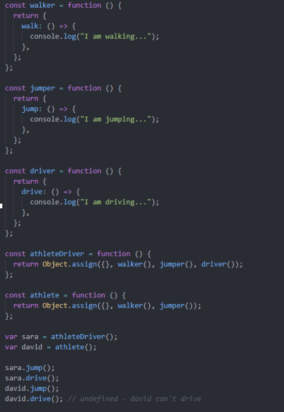

# Composition

- For complex object hierarchy it creates readable and simpler code

- Gives better flexibility of what functions and elements to inherit

- Let’s say we have a class structure as shown on below.

- You compose an object only of its needed parts.

- You break down all functionality into common pieces and pick the ones you need for each of your objects. At the end, you will have more combinations and less convoluted code.

- With Composition you can decide what functions to add to each object by using Object.assign();



