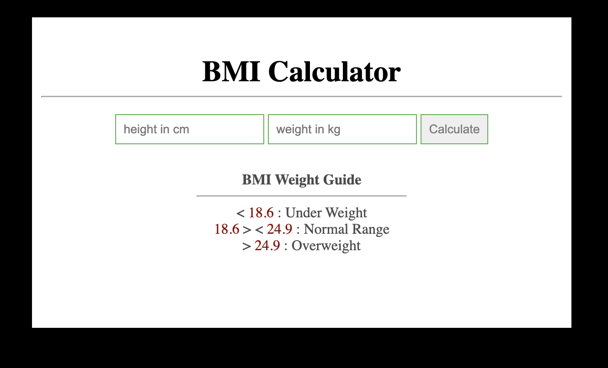
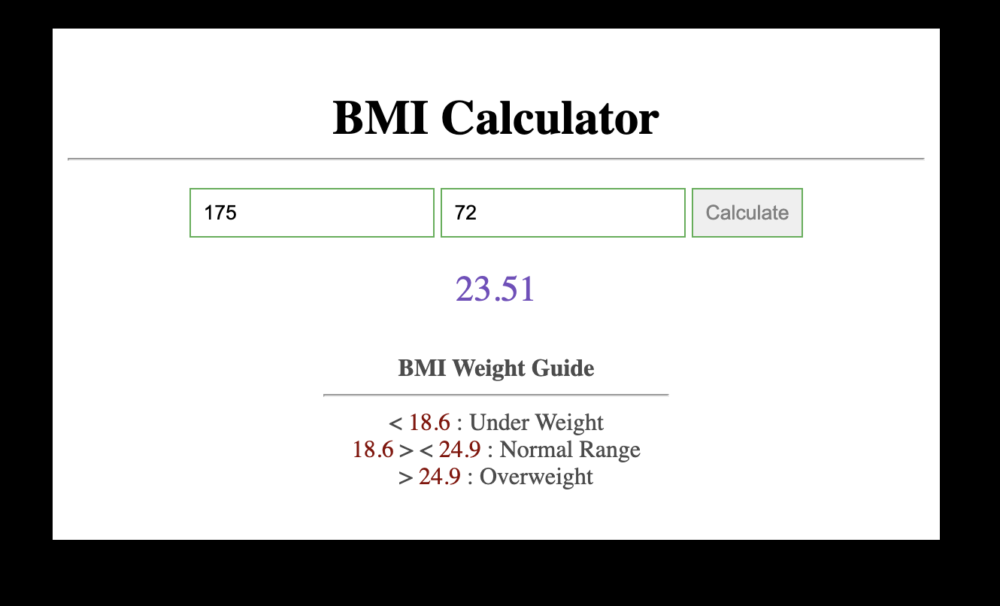

# BMI

> DOM Events

## 1. Intro

### Goal

The goal is to calculate the body mass index of a person. Task is not that too hard. Goal is to learn how to work with DOM events.

**STARTING POINT**



**WORKSHOP GOAL**



### Setup

Here are the instructions for our Git workflow one more time.

Both partners should fork this [repo](https://github.com/urakymzhan/bmi) and clone their fork to their respective machines.

**PartnerA:** Copy the url for your fork's github page from your browser's url bar (it will be something like https://github.com/<PartnerA>/PairExercise.bmi) and send that url to PartnerB via Slack

**PartnerB:** Copy the url that PartnerA sent you, cd into your local clone on your machine and execute this command using that url:

`git remote add partnerA <partnerA_github_url>`

- Repeat the two steps above, swapping PartnerA and PartnerB
- Both partners should read the README.md of the project (separately)
- Once both partners have read the README.md, start the pairing timer and complete the test specs in order

**When it's time to switch roles**

PartnerA should commit all of their work and push it to their main branch:

```
git add -A
git commit -m "Easy to understand commit message"
git push origin main
```

PartnerB should then pull from their partner's remote (NOT from their own origin):

```
git pull partnerA main
```

Once PartnerB completes the pull, they will have all of PartnerA's work, and you will both be ready to continue with roles reversed. When the time comes to switch again, you simply perform the same process (with roles reversed).

## 2. Getting Started

### Observation

Open up the `index.html` file. For your convenience we provided all the html, css code ready for you.
You will see `form` element with 2 inputs and a single button.
A `div` with `id` `results` will be the container to output your result.

### Input Values

Think about how you get `value` from an input elemnt. Imagine user typed **height** or **weight**. What are the DOM **event listeners** can you use to get `values`.

**Hint:** `querySelector, getElementById etc`

After you get your input values `calculate` the BMI using the provided formula:

```javascript
const bmi = (weight / ((height * height) / 10000)).toFixed(2);
```

### Time to Submit!

Think about how do you submit your input data to show them on the page?

**Hint:** `form`

### Be careful

Things that you need to consider while performing this workshop:

- Show some message when user inputs `empty` or `NaN` height or weight.
- Prevent user from submitting by default. Hint: `preventDefault()`

### Extra

- Tell user if they are normal, under weight or over weight

> Want to give feedback? Did more than asked? Please slack your instructor.
