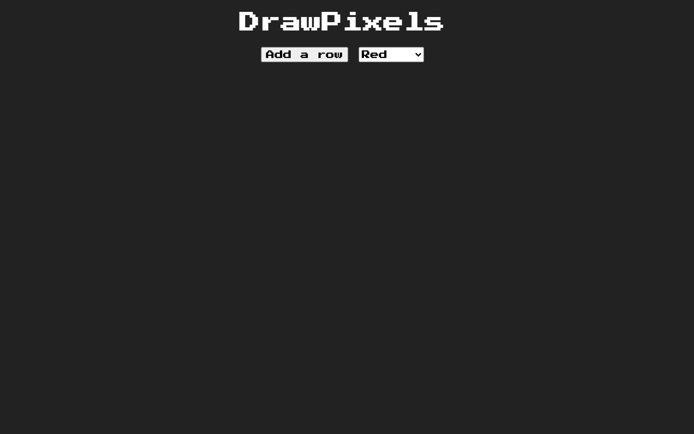
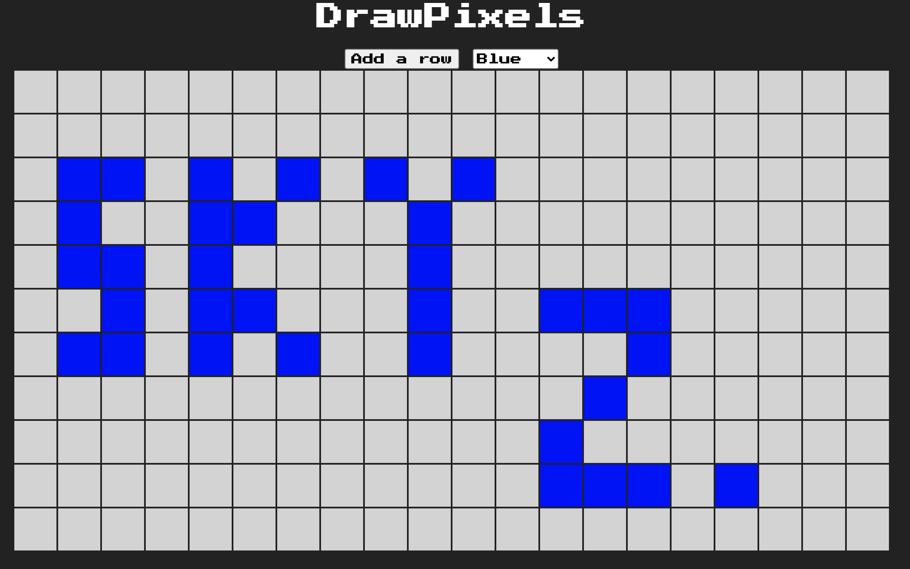
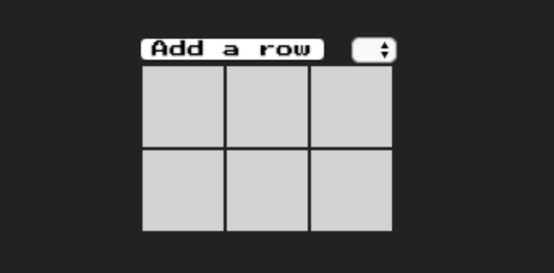

# DrawPixels

> DOM Manipulation and Event Delegation

## 1. Introduction

### Goal

Today, we'll be building a small editor for making 8-bit art! You'll be able to re-create characters from all your favorite classic video games! Oh, and you'll also practice event handling and delegation, DOM manipulation, and some basic CSS.

**STARTING POINT**



**WORKSHOP GOAL**



### Setup

Here are the instructions for our Git workflow one more time.

Both partners should fork this [repo](https://github.com/urakymzhan/drawPixels) and clone their fork to their respective machines.

**PartnerA:** Copy the url for your fork's github page from your browser's url bar (it will be something like https://github.com/<PartnerA>/PairExercise.DrawPixels) and send that url to PartnerB via Slack

**PartnerB:** Copy the url that PartnerA sent you, cd into your local clone on your machine and execute this command using that url:

`git remote add partnerA <partnerA_github_url>`

- Repeat the two steps above, swapping PartnerA and PartnerB
- Both partners should read the README.md of the project (separately)
- Once both partners have read the README.md, start the pairing timer and complete the test specs in order

**When it's time to switch roles**

PartnerA should commit all of their work and push it to their main branch:

```
git add -A
git commit -m "Easy to understand commit message"
git push origin main
```

PartnerB should then pull from their partner's remote (NOT from their own origin):

```
git pull partnerA main
```

Once PartnerB completes the pull, they will have all of PartnerA's work, and you will both be ready to continue with roles reversed. When the time comes to switch again, you simply perform the same process (with roles reversed).

### Familiarize Yourself With Starting Point

Take a moment to examine the starting point with your partner. The most important file to check out is `index.html` - it contains HTML that our browser will use to construct the DOM, as well as link and script tags that cause the browser to request additional resources

## 2. Creating Rows

### Styling Table Cells

Our first task will be to get our grid of cells to appear.

An HTML table has three basic ingredients - the `<table>` tag, which contains a series of table rows `(<tr>)` as children, which in turn contain a series of table data cells `(<td>)`. (There are other some others, but we won't worry too much about them today).

In index.html, add the following HTML between the opening and closing `<table>` tags

```html
<tr>
  <td></td>
  <td></td>
  <td></td>
</tr>
<tr>
  <td></td>
  <td></td>
  <td></td>
</tr>
```

If you refresh the page, you won't actually see any difference - this is because our `td` cells don't have any style! If you refer back to our goal, you'll see that what we want is for each `td` to have a **light gray background** color with dimensions of about **50x50** pixels.

Add a CSS rule to style.css that will make each td look the way we want
You'll know you've succeeded if you see something like this:



### Creating Elements

Creating a new DOM element with JavaScript is a two step process:

1. First, you must create the new element using `document.createElement`
2. Second, you must append the element to its parent using `parentElement.appendChild(newElement)`

For example, to add a new `li` to a `ul`, we might do something like this:

```javascript
const ul = document.getElementById('the-ul');
const newLi = document.createElement('li');
ul.appendChild(newLi);
```

Rather than hard-code a certain number of table rows in our HTML, let's create them dynamically using JavaScript!

In `index.html`, remove the `<tr>` and `<td>` elements that you added in the previous step

In `script.js`:

Select the table DOM element and store it in a variable

Write a function called `makeRow`

Your makeRow function should create a new `tr` element. It should create and append some number of new `td` elements to the tr (the example uses **20**), and then append the tr element to the `table` element

Invoke the makeRow function several times
Check it out by refreshing the page - you should see a new row of cells for each time you invoked makeRow!

### Making Rows

Now that we have a convenient function for creating rows, let's make it so that users can add rows themselves when they click that "Add Row" button!

In `script.js`:

- Select the "add row" button's DOM element and store it in a variable
- Attach an event listener to the "add row" button - whenever the "add row" button is clicked, we want to fire the `makeRow` function

Refresh the page to try it out - you should be able to add as many rows as your heart desires!

## 3. Adding Color

### Color Classes

Our next task will be to make it so that clicking on a cell will toggle its color (we'll just deal with one color for now).

We'll determine a cell's color by the presence or absence of a CSS class.

A common (and easy-to-read) way to do this might be to make several CSS classes that correspond the color(s) we want.

For example, a CSS class to give an element a red background color might be:

```css
.red {
  background-color: red;
}
```

Add several CSS classes like the one above to your `style.css`. Feel free to choose your favorite colors!

### Event Delegation

We want to execute a JavaScript function every time a `<td>` cell is clicked. Does this mean we need to go through and add an event listener to **every** `<td>` element?

**No!** We can use event delegation. We'll attach the event listener to a parent element. When the child element is clicked, the event will "bubble up" to the parent and execute the parent's event handler.

- Determine which element to attach the event listener to. This should be the common ancestor of every `<td>` element

**Hint:** The `table` element makes the most sense! If we went with `tr`, we would need to attach it to every tr.

Write a function called `colorize` and attach it as the click handler for the parent element. For now, simply log out the string `"clicked!"` - we'll deal with adding color in the next step

Try it out by refreshing and opening your browser's dev tools. Add some cells and click them - you should see "clicked!" logged to the console!

### Event Target

Now that we can fire a click handler, it's time to change the color of our td cells!

Because we're representing our colors as CSS classes, we can change the appearance of the DOM by mutating the `className` property on the selected DOM node.

For example:

`tdCell.className = 'red' // gives this DOM node the 'red' class`

All we need to do is get the appropriate DOM node. Fortunately, we can find it on the `event` object that our event handler receives! In any event handler, `event.target` will be a reference to the actual DOM node that was clicked (which is not necessarily the DOM node to which we've attached the event listener).

In our event handler (that is, the colorize function),

- If your `colorize` function does not yet list the `event` as a parameter, add it now
- Obtain the target that was clicked from `event.target`
- If the target DOM node does not currently have a `className`, set it equal to one of your colors (to toggle it on)
- If the target DOM node already has a `className`, set it equal to an empty string (to toggle it off)

Try it out - if clicking a cell causes that cell's color to change, you'll know that you've achieved your goal!

## 4. Switching Colors

### Change Event

Last but not least, let's make it so that we can pick from a variety of colors! To do this, we'll take advantage of that `<select>` element and the `"change"` event it fires whenever we select something.

In `index.html`, add an `<option>` tag for each CSS color class from your `style.css`
For example, if we wanted to choose between red and blue:

```html
<select>
  <option value="red">Red</option>
  <option value="blue">Blue</option>
</select>
```

Don't forget to include the `value` property! You want the value to match the names of your CSS class names, which should be lowercase. However, the way the options present themselves to the user should be capitalized!

- In your `script.js`, grab the `select` element from the DOM and attach an event listener for the `"change"` event. Give it a callback function that expects to receive the event as an argument, and then console logs `event.target.value`.

Try it out by refreshing the page and opening your browser's dev tools. Every time you pick something from the `select field`, you should see that option's value logged to the console.

### Choosing a Color

Now that we can choose a color, our JavaScript app needs some notion of a "chosen color". We want to put aside whatever color has been chosen by the user, and then change the cells that we click to be that color.

Try to figure it out! The first hint below will suggest an approach if you get stuck.

**Hint:** You could simply store the selected color in a variable, and reassign that variable every time someone changes the color. Make sure to give it some default value, as well (ideally, this should match the first option in your select).

You'll know you've succeeded when you can successfully change colors. You may find a quirk occurs when trying to "paint over" an existing color - we'll address this in the next section!

## 5. Extra Credit

### Finishing Touches

There's a finicky little issue that could happen if someone clicks the space between the table cells - we might end up coloring the tr or table in the background! We should be a bit more deliberate and make sure that we only change the background color of the target element if that target element is a 'td' element.

How can we tell what kind of element the event target is?

**Hint: Solution** Try checking out `event.target.tagName`

### Dragging to Paint

It can be tiresome to have to click each cell individually. Try to make it so that dragging the mouse over cells will "paint" them the specified color! You'll take advantage of `"mouseup"`, `"mousedown"` events that you used to drag and drop cats, as well as the `"mouseover"` event (instead of the slightly different `"mousemove"` event from before)!

### Additional Paint Tools

Trick out your editor by adding some common utilities! Here are some suggestions:

- Add the ability to fill the whole grid with one color
- Add the ability to fill any non-colored cells with one color
- Add the ability to clear the grid
- Add controls for the user to adjust the number of columns
- Add controls for the user add/remove rows and columns

> If you have questions, get help from your instructor or ask help from TA's
