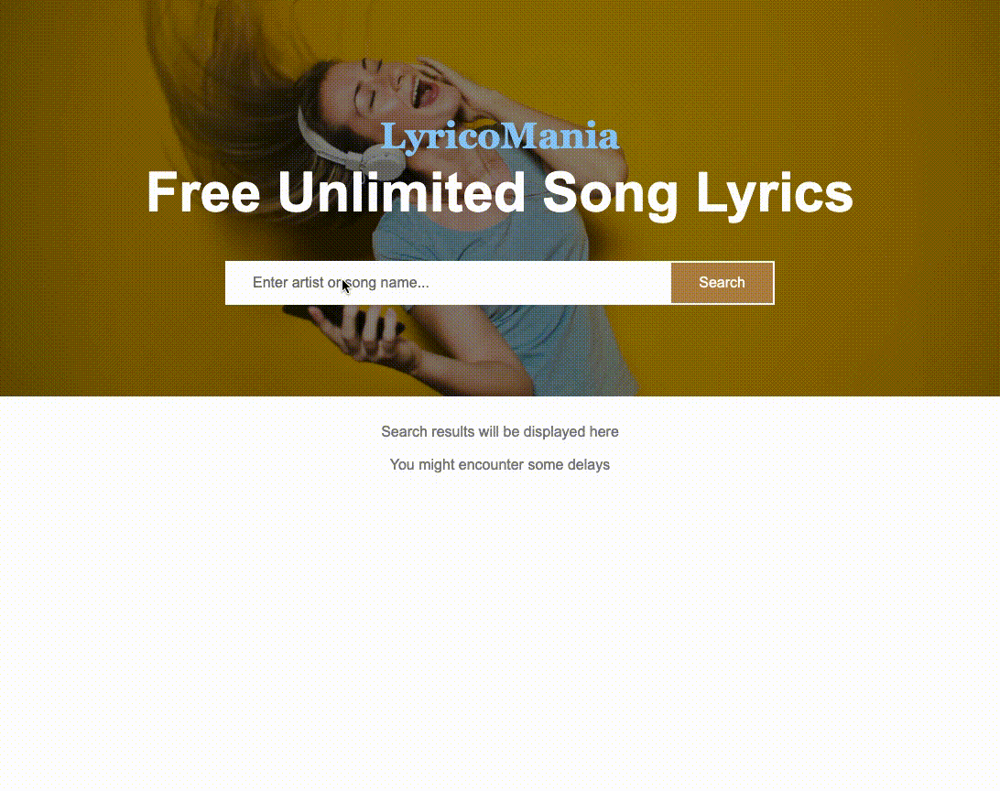

# LyricoMania

> Asyn javascript, DOM manipulation

## 1. Intro

### Goal

Find songs, artists and lyrics using the [lyrics.ovh](https://lyrics.ovh) API

Read their **documentation** first.

**STARTING POINT**


**WORKSHOP GOAL**



### Setup

Here are the instructions for our Git workflow one more time.

Both partners should fork this [repo](https://github.com/urakymzhan/lyricoMania) and clone their fork to their respective machines.

**PartnerA:** Copy the url for your fork's github page from your browser's url bar (it will be something like https://github.com/<PartnerA>/PairExercise.lyricoMania) and send that url to PartnerB via Slack

**PartnerB:** Copy the url that PartnerA sent you, cd into your local clone on your machine and execute this command using that url:

`git remote add partnerA <partnerA_github_url>`

- Repeat the two steps above, swapping PartnerA and PartnerB
- Both partners should read the README.md of the project (separately)
- Once both partners have read the README.md, start the pairing timer and complete the test specs in order

**When it's time to switch roles**

PartnerA should commit all of their work and push it to their main branch:

```
git add -A
git commit -m "Easy to understand commit message"
git push origin main
```

PartnerB should then pull from their partner's remote (NOT from their own origin):

```
git pull partnerA main
```

Once PartnerB completes the pull, they will have all of PartnerA's work, and you will both be ready to continue with roles reversed. When the time comes to switch again, you simply perform the same process (with roles reversed).

## 2. Getting Started

### Observation

Open up the `index.html` file. For your convenience we provided all the html, css code ready for you.

### Start Coding

In total you can get away using 2 urls from API:

- To search by term: `https://api.lyrics.ovh/suggest/{whatever-user-types-on-input}`
- To get the lyrics of particular song: `https://api.lyrics.ovh/v1/${artist}/${songTitle}`

You can use async/await or promise chain for fetching data

Ex:

```javascript
async function searchSongs() {
  let response = await fetch("paste url link here");
  // your code
}
```

```javascript
function searchSongs() {
  fetch("paste url link here")
    .then((response) => response.json())
    .then((users) => console.log(users));
}
```

After getting a song you might want to store into a **result element**

Update `result` div with songs and when clicked `Get Lyrics` update with lyrics.

```javascript
const showData = (data) => {
  result.innerHTML = `
    <ul class="songs">
      ${data.data
        .map(
          song => `<li>
      <span><strong>${song.artist.name}</strong> - ${song.title}</span>
      <button class="btn" data-artist="${song.artist.name}" data-songtitle="${song.title}">Get Lyrics</button>
    </li>`
        )
        .join('')}
    </ul>
  `;
```

### Tips

- Display UI with song/artist input
- Fetch songs/artists and put in DOM
- Add get lyrics functionality and display in DOM

### Be careful

- What if no data returns from API, or some type error occurs while fetching songs or lyrics?
- Might want to handle that too.

### Extra

- Add pagination using `prev` and `next` features from API. But you might get **CORS** issues.

> Want to give feedback? Did more than asked? Please slack your instructor.
