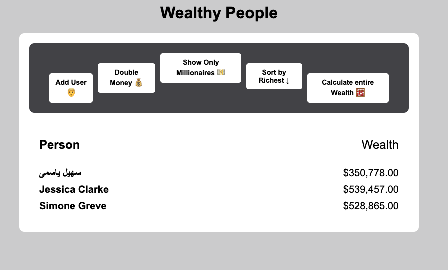
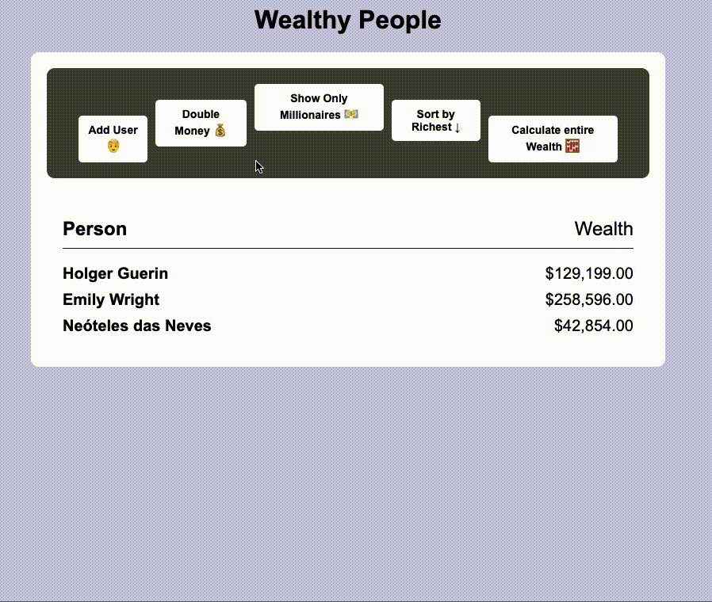

# Wealthy People

> High order array methods, DOM manipulation

## 1. Intro

### Goal

Goal is to learn how to work with external API's and perform fetching.

Fetch random users from the [randomuser.me](https://randomuser.me) API.

Read their documentation first.

**STARTING POINT**



**WORKSHOP GOAL**



### Setup

Here are the instructions for our Git workflow one more time.

Both partners should fork this [repo](https://github.com/urakymzhan/wealthy-people) and clone their fork to their respective machines.

**PartnerA:** Copy the url for your fork's github page from your browser's url bar (it will be something like https://github.com/<PartnerA>/PairExercise.wealthy-people) and send that url to PartnerB via Slack

**PartnerB:** Copy the url that PartnerA sent you, cd into your local clone on your machine and execute this command using that url:

`git remote add partnerA <partnerA_github_url>`

- Repeat the two steps above, swapping PartnerA and PartnerB
- Both partners should read the README.md of the project (separately)
- Once both partners have read the README.md, start the pairing timer and complete the test specs in order

**When it's time to switch roles**

PartnerA should commit all of their work and push it to their main branch:

```
git add -A
git commit -m "Easy to understand commit message"
git push origin main
```

PartnerB should then pull from their partner's remote (NOT from their own origin):

```
git pull partnerA main
```

Once PartnerB completes the pull, they will have all of PartnerA's work, and you will both be ready to continue with roles reversed. When the time comes to switch again, you simply perform the same process (with roles reversed).

## 2. Getting Started

### Observation

Open up the `index.html` file. For your convenience we provided all the html, css code ready for you.

### Tips

See how 3 random users popped up on inital page load. That is creating elements `createElement` after fetching some users from API and sticking it to the DOM.

Subsequent users will be just added to them.

You can use async/await or promise chain for fetching data

Ex:

```javascript
async function getRandomUser() {
  let response = await fetch('urllinkhere');
  // your code
}
```

```javascript
function getRandomUser() {
  fetch('urllinkhere')
    .then((response) => response.json())
    .then((users) => console.log(users));
}
```

### More Tips

- Use `forEach()` to loop and output user/wealth
- Use `map()` to double wealth
- Use `filter()` to filter only millionaires
- Use `sort()` to sort by wealth
- Use `reduce()` to add all wealth

### Even More Tips

You might want to create functions for every event that is happening (Ex: Add User button => getRandomUser(), Double Money button => doubleMoney() and so on.)

Lastly don't forget to update the DOM after each update.(you can think of it as function call)

> Want to give feedback? Did more than asked? Please slack your instructor.
