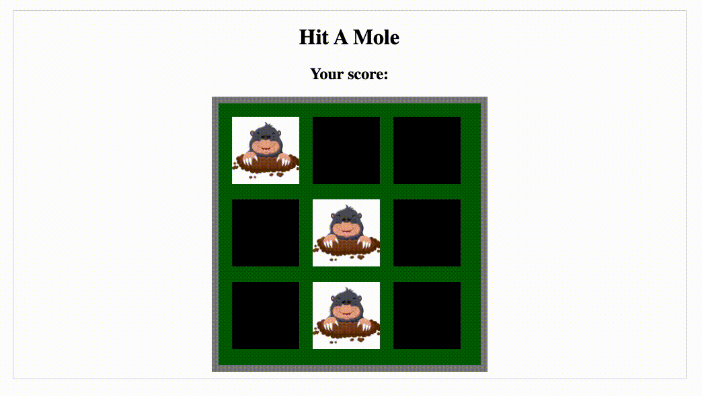

# Hit A Mole 
> DOM pair exercise workshop


## 1. Introduction

### What we're building

In this lab you'll create a dirt-simple Hit-a-mole game, using DOM manipulation & DOM events.



### Setup

DOM Events are your channel of communication to user input. Each user action results in a discrete event. The whole of human-computer interaction arises from listening and reacting to these events.

Clone this [repo](https://github.com/urakymzhan/hit-a-mole-starter) (hit-a-mole-starter) to your local machine
- cd into it and open index.html ( You'll see some holes )


### Deciphering the Starting Point
This lab starts with three files:

`index.html`

The index references a css file and a js file. It contains one `<h1>` tag with id of "heading", one `<div>` tag with id of "hit-a-mole" and nine "holes" (actually, nine `<div>` tags with the class name of "hole").

```style.css```

This CSS positions everything in the page and provides the classes to use holes or moles as background images for the divs.

```index.js```

This contains a single line:

```javascript

 let score = 0;

 ```


Clearly this will control the score of the game in the future, but for now let's start by making sure we can make moles appear.


## 2. Let's make a Hit-a-Mole

### Appearing Moles
For a Hits-a-Mole game, we're currently not seing much mole action. Let's change that.

We will manipulate the DOM to randomly assign the class "mole" to one of our `<div class="hole">` tags.

In the JavaScript file, start by getting all DOM nodes that contain the "hole" class (document.getElementsByClassName comes to mind...). Assign the returned Array-like object to a variable.

Now, we want to assign this list to a `holes` variable. You can convert it to an Array before assigning (and that's usually a good idea), but in this lab in particular you're not going to need any array methods.

**Hint:** Getting all the holes
```javascript
const holes = document.getElementsByClassName("hole");
```

Next, we want to get a random number between zero and the amount of holes we have, and toggle the "mole" class in that specific `<div>`.

**Hint:** Mole on a random hole
```javascript
const randomHoleIndex = Math.floor(Math.random() * holes.length);
holes[randomHoleIndex].classList.toggle("mole");
```


### Hitting
To Hit a mole, the user needs to click it, so your next task is to add an event listener.

The first impulse might be to add an event listener to every single hole, but that's kind of cumbersome, don't you think?

On a bigger scale, adding individual event listeners to every single element can also lead to performance problems (not in our case, because we only have 9 holes).

Instead, we will use Event Delegation which, as you just learned, refers to the process of using event propagation (bubbling) to handle events at a higher level in the DOM than the element on which the event originated.

So, add an event listener for the element with ID "hit-a-mole" (the parent div containing all holes) and check if the event's `.target` property (the DOM node where the event originated) matches the `.mole` selector:

```javascript
const gameArea = document.getElementById('hit-a-mole');
gameArea.addEventListener('click', function(clickEvent) {
  if (clickEvent.target.matches('.mole')) {
    // we hit a mole!
  }
});

```

If the origin of the click has a 'mole' class, it means that the user successfully hit it! Increase the score and get rid of that mole (aka remove the 'mole' class).