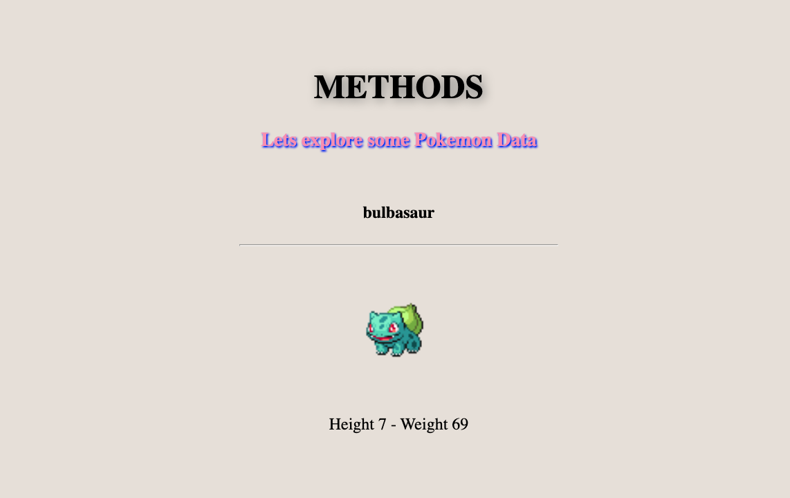

# Pokemon - JS built-in methods practice

Group or Individual Exercise

## Preparation

Go ahead and **clone** this [repository "Pokemon"](https://github.com/SkyZone-LLC/pokemon).

## What this project about?

- We have a ready Pokemon data
- It is an object and contains different data types. Such as numbers, strings, arrays etc.
- This project mostly incorporates JavaScript methods that are learned in last class.
- _Lets get started!_

#### Challenge 1

Get the **height** and **weight** of Pokemon and return them in String format

#### Challenge 2

Store the result of Step 1 and again convert **height** and **weight** to `integer`.
Then calculate Pokemons BMI. Assume that weight and height are in in **kg** and **meters** consequently.
Formula for BMI : `BMI = kg/m2`

#### Challenge 3

Store the name of Pokemon to a new variable. Then using new varibale calculate the `length` (word count) of Pokemons **name** and make it an **upper case**.

#### Challenge 4

Make sure name contains word "bulba"

#### Challenge 5

Now cut **first** 2 characters of **name** and store as a new variable. Also get **last** 2 charaters of name and store as a new variable. At the end add this 2 variables and return a **new** name that consists of first 2 and last 2 characters of original name.
_HINT: try to use string method_

#### Challenge 6

Now store new name variable into an **array**. And console to the result.

#### Challenge 7

Console log the names of each "type" that is inside types array in original data. Make sure you see "poison" and "grass" as a result.

#### Challenge 8

Make sure/check abilites is an array type. Abilites can be found from same data object.

#### Challenge 9

From abilities array get the **last** ability (object) and console the **name** of it.

#### Challenge 10

Now take that last ability (object) and again **put it back** to abilities array.

#### Challenge 11

Loop throgh the stats data and console the **base_stat** values

#### Challenge 12

Store Step 11 values into new array and **filter** and console the values that above **47**.

#### Challenge 13

**Reverse** an array that contained **base_stat** values and return a string combining all these values.

#### Challenge 14

From **base_stat** values array return **shallow** copy only 2 first values as an array.

#### Challenge 15

From **base_stat** values array **replace** first number with your name. _HINT: Modify the original array_

#### Challenge 16

Console log keys and values of data object.
_HINT: return values can be an array or a string type. Use Object, Array methods or loop_

#### Challenge 17

From data show avatar, name, height and weight on the DOM.
To do that copy and paste below code:
_Don't worry we will learn DOM_

```javascript
const avatar = document.querySelector('#pokemon-avatar');
const pok_name = document.querySelector('#pokemon-name');
const info = document.querySelector('#info');
const name = data.name;
const height = data.height;
const weight = data.weight;
const url = data.sprites.front_default;
avatar.src = url;
pok_name.innerHTML = name;
info.innerHTML = `
  <span> Height ${height}</span> -
  <span> Weight ${weight}</span>
`;
```

## Verify

- If you successfully done Step 17, you should see this page!
- If "Yes". Great. **You are Done!**


